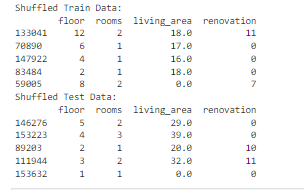
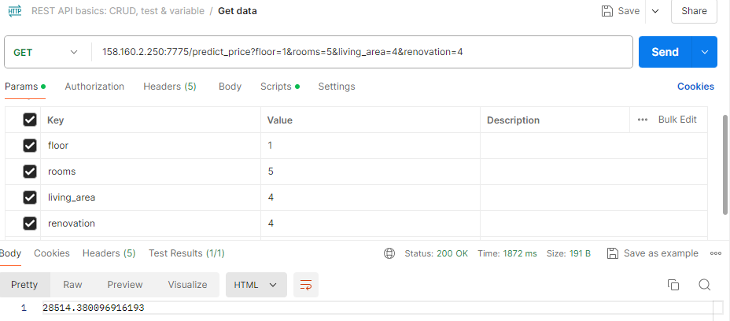

# Final Project

### The data was taken from the Yandex.Reality containing real estate listings for apartments in St. Petersburg and Leningrad Oblast from 2016 till the middle of August 2018.

## Information of statistics

Firstly, I cleaned data and dropped unnecessary columns to get cleaned dataset. Then, I shuffled the data to train and test:


I used several models like:
- Decison tree
- Random Forest 
- Cat Boost
- Gradient Boost Regressor

Also I used tunig hyperparameters of some models. I used Random_forest_model.

## Run app

Use file app.py and use the command:
```
python app.py
```
Also you should activate the virtual environment in your Visual Studio, to do this use the command:
```
source .env/bin/activate
```
*Instead of 'env' use the name that you have for your vitual environment
## Info about Dockerfile


The first line provides info about basic image and I used ubuntu with version 20.04. 
Maintainer is me (Rakhat).
Then there is a command that update all dependencies in our basic image.
The 'Copy' command will copy all our source code to folder opt/gsom_predictor.
Also, we change our workdir, then we run command inside our docker container to install python3-pip to install our requirements.Then we install all requirements that we provided in our file 'requirements'. After that we run python3 app.py


## Link to the Postman to predict prices
Here is the link - [Go to the Postman](https://web.postman.co/workspace/My-Workspace~7f2023db-b996-436d-8f8d-7a35da738daa/request/36187768-2dcc6883-f0ae-49f1-875d-7e4c846e2e77)  

In the beginning you should indicate the SSH of your VM.
In the 'Key' column type the parameters such as:
- floor
- rooms
- living_area
- renovation

'Value' indicate based on your preferences

The port that is used is 7775


Then you should press send in order to see the price

## Run app using Docker

Use command:
```
docker build -t rakhatgsom/gsom_e2e24:v.0.1 . 
```
And then:
```
docker run --network host -d rakhatgsom/gsom_e2e24:v.0.1
```
Then go to the Postman and use the same port (7774)